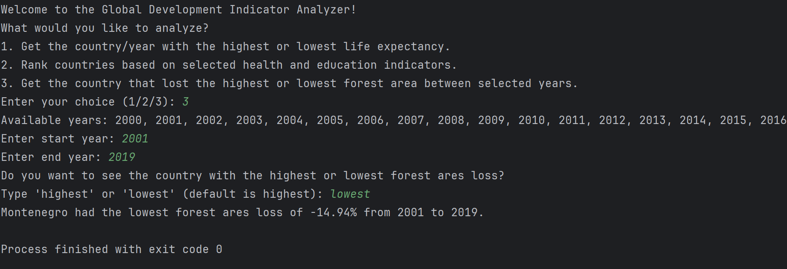

# Global Development Indicators Analyzer

## Subject & Course Information

**Faculty:** Faculty of Engineering and Technology

**Course:** PRG2104: Object Oriented Programming

**Programme:** BSc (Hons) Computer Science

**Year:** Year 2

**Semester:** Academic Session 2025, Semester 3

**Assignment:** Assignment 2

## Project Overview

**The Global Development Indicators Analyzer** is a comprehensive Scala application that analyzes global development data from 2000-2020. This project demonstrates **advanced object-oriented programming principles, polymorphism, and sophisticated collection** operations to answer critical questions about global development trends.

## Demonstration

### Project Showcase

This Global Development Indicators Analyzer demonstrates excellence in object-oriented programming through several key implementations:

#### 1. GUI Application Demo

- **JavaFX Interface:** Modern, user-friendly graphical interface built with JavaFX
- **FXML Layout:** Separation of UI design and logic using FXML files
- **Interactive Controls:** Dynamic filtering and query execution through GUI components
- **Real-time Results:** Immediate display of analytical results with formatted output


*Figure 1: JavaFX GUI Application Interface - Professional data analysis dashboard with interactive controls*

#### 2. CLI Application Demo

- **Interactive Command-Line Interface:** Professional CLI with guided user input
- **Flexible Query Options:** Multiple filtering criteria for each analysis type
- **Data Validation:** Input verification for years, countries, and analysis parameters
- **Formatted Output:** Clean, readable results presentation

##### Question 1: Life Expectancy Analysis

**With Custom Filtering:**

*Figure 2a: CLI Life Expectancy Query with Country/Year Filtering*

**Standard Query:**

*Figure 2b: CLI Life Expectancy Query - Default Parameters*

##### Question 2: Health & Education Excellence

**With Custom Indicators:**

*Figure 3a: CLI Health & Education Ranking with Custom Indicator Selection*

**Standard Analysis:**

*Figure 3b: CLI Health & Education Ranking - Default Multi-Criteria Analysis*

##### Question 3: Forest Area Loss Analysis

**With Custom Time Range:**

*Figure 4a: CLI Forest Area Loss Analysis with Custom Year Range*

**Standard Period (2000-2020):**

*Figure 4b: CLI Forest Area Loss Analysis - Standard 20-Year Period*


## Assignment Questions Addressed

### 1. Life Expectancy Analysis

**Question:** Which country achieved the highest life expectancy in the dataset, and in which year?

**Implementation:** Our `lifeExpectancyQuery` method efficiently processes the entire dataset using functional programming paradigms and collection operations to identify optimal life expectancy records with flexible filtering capabilities.

### 2. Health & Education Excellence

**Question:** Which country performed best in Health & Education throughout the entire dataset?

**Evaluation Criteria:**

- Life expectancy
- Child mortality rates
- School enrollment (secondary)
- Healthcare capacity
- Health development ratio

**Implementation:** The `bestHealthEducationQuery` method employs advanced collection grouping and aggregation techniques to compute composite scores across multiple health and education indicators.

### 3. Forest Area Loss Analysis

**Question:** Which country had the greatest loss of forest area from 2000 to 2020, and what was the amount lost?

**Implementation:** Our `forestLossQuery` method utilizes sophisticated data transformation and temporal analysis to calculate forest area changes across the specified timeframe.

## Technical Architecture

### Core Object-Oriented Programming (OOP) Principles

#### 1. Encapsulation

- **Data Model (`GdpData` trait and `GdpRecord` case class):** Encapsulates all global development indicators in a well-defined structure
- **Agent Class:** Encapsulates all analytical operations and business logic
- **DataLoader Object:** Encapsulates data loading and CSV parsing functionality

```scala
// Trait defines the contract for GDP data
trait GdpData {
  def year: Int
  def country_name: String
  def life_expectancy: Option[Double]
  // ... other fields
}

// Case class provides immutable implementation
case class GdpRecord(...) extends GdpData
```

#### 2. Abstraction

- **GdpData Trait:** Provides abstract interface for all development indicator data
- **Agent Class:** Abstracts complex analytical operations behind simple method calls
- **Utility Methods:** Abstract common operations like `averageOfDefined` for reusable functionality

#### 3. Inheritance

- **GdpRecord extends GdpData:** Demonstrates inheritance hierarchy
- **JavaFX Application Structure:** Extends JavaFX classes for GUI implementation

### Advanced Polymorphism Implementation

#### 1. Parametric Polymorphism

```scala
// Generic Option handling for different data types
private def averageOfDefined(seq: Seq[Option[Double]]): Option[Double]
private def safeToOptionDouble(s: String): Option[Double]
```

#### 2. Method Overloading

```scala
// Multiple query variations with different parameter combinations
def lifeExpectancyQuery(highest: Boolean = true): Option[(String, Int, Double)]
def lifeExpectancyQuery(highest: Boolean, filterCountry: Option[String]): Option[(String, Int, Double)]
```

#### 3. Trait-based Polymorphism

The `GdpData` trait enables polymorphic behavior across different data implementations, allowing for future extensibility without breaking existing code.

### Sophisticated Collection Operations

#### 1. Advanced Filtering and Mapping

```scala
val filtered = records
  .filter(_.life_expectancy.isDefined)           // Type-safe filtering
  .filter(r => filterCountry.forall(_ == r.country_name))  // Conditional filtering
  .filter(r => filterYear.forall(_ == r.year))            // Multiple criteria
```

#### 2. Complex Grouping and Aggregation

```scala
val group = records.groupBy(_.country_name).map { case (country, recs) =>
  val scores = indicators.map {
    case "life_expectancy" => averageOfDefined(recs.map(_.life_expectancy))
    case "child_mortality" => averageOfDefined(recs.map(_.child_mortality)).map(100 - _)
    // Pattern matching for different indicators
  }
  country -> scores.flatten.sum  // Sophisticated aggregation
}
```

#### 3. Functional Data Transformation

```scala
// Elegant functional programming with flatMap and for-comprehensions
val group = records.groupBy(_.country_name).flatMap { case (country, recs) =>
  val byYear = recs.filter(_.forest_area_pct.isDefined)
                  .map(r => r.year -> r.forest_area_pct.get).toMap
  
  for {
    start <- byYear.get(fromYear)
    end <- byYear.get(toYear)
  } yield {
    val loss = start - end
    country -> loss
  }
}
```

## Code Quality & Maintainability Features

### 1. Modular Design

- **Separation of Concerns:** Each class has a single, well-defined responsibility
- **DataLoader:** Handles only data loading and parsing
- **Agent:** Focuses exclusively on analytical operations
- **GUI Components:** Separate presentation layer from business logic

### 2. Extensibility

- **Trait-based Architecture:** Easy to add new data types implementing `GdpData`
- **Configurable Queries:** Methods accept parameters for different analysis scenarios
- **Plugin Architecture:** New analytical methods can be easily added to the `Agent` class

### 3. Error Handling & Robustness

```scala
// Safe parsing with default values
private def safeToDouble(s: String): Double =
  if (s == null || s.trim.isEmpty) 0.0 else s.toDouble

private def safeToOptionDouble(s: String): Option[Double] =
  if (s == null || s.trim.isEmpty) None else Some(s.toDouble)
```

### 4. Type Safety

- **Option Types:** Proper handling of missing data with `Option[Double]`
- **Case Classes:** Immutable data structures prevent accidental modifications
- **Strong Typing:** Compile-time error detection for data type mismatches

### 5. Performance Optimization

- **Lazy Evaluation:** Collections use lazy evaluation where appropriate
- **Efficient Grouping:** Single-pass grouping operations minimize data traversal
- **Memory Efficiency:** Immutable data structures with structural sharing

## Project Structure

```
PRG2104-Final-Assignment/
├── build.sbt                       # SBT build configuration
├── .gitignore                      # Git ignore file
├── README.md                       # Project documentation
├── images/                         # Project demonstration screenshots
│   ├── gui.png                     # GUI application interface
│   ├── cli_q1_with_customization.png     # CLI Q1 custom filtering demo
│   ├── cli_q1_without_customization.png  # CLI Q1 standard demo
│   ├── cli_q2_with_customization.png     # CLI Q2 custom indicators demo
│   ├── cli_q2_without_customization.png  # CLI Q2 standard demo
│   ├── cli_q3_with_customization.png     # CLI Q3 custom time range demo
│   └── cli_q3_without_customization.png  # CLI Q3 standard demo
├── py/                             # Python analysis scripts
│   ├── run.py                      # Python data analysis
│   ├── output.txt                  # Analysis results
│   └── README.md                   # Python component docs
├── project/                        # SBT project configuration
│   └── build.properties            # SBT version specification
├── src/
│   └── main/
│       ├── scala/
│       │   ├── Main.scala              # GUI entry point
│       │   ├── CLIMain.scala           # CLI entry point
│       │   └── com/sunway/welovesunway/
│       │       ├── GdpData.scala       # Data model (trait + case class)
│       │       ├── Agent.scala         # Core analytical engine
│       │       ├── DataLoader.scala    # CSV parsing and data loading
│       │       ├── JavaFXApp.scala     # JavaFX application framework
│       │       └── MainController.scala # GUI controller logic
│       └── resources/
│           ├── Global_Development_Indicators_2000_2020.csv # Dataset
│           └── com/sunway/welovesunway/
│               └── MainApp.fxml        # JavaFX GUI layout definition
└── target/                         # Compiled output directory
    └── scala-3.3.6/                # Scala version-specific builds
```

## Dependencies & Technology Stack

- **Scala 3.3.6:** Modern functional programming language
- **JavaFX 21.0.5:** Cross-platform GUI framework
- **Scala-CSV 2.0.0:** Efficient CSV parsing library
- **SBT:** Scala build tool for dependency management

## Running the Application

### GUI Mode

```bash
sbt run
```

### CLI Mode

```bash
sbt "runMain com.sunway.welovesunway.CLIMain"
```

#### 3. Advanced OOP Features in Action

**Encapsulation Example:**

```scala
// Data is safely encapsulated within the GdpRecord case class
val data = DataLoader.loadData("dataset.csv")
val analyzer = new Agent(data)  // Business logic encapsulated in Agent class
```

**Polymorphism Demonstration:**

```scala
// Trait-based polymorphism allows flexible data handling
trait GdpData { /* abstract interface */ }
case class GdpRecord(...) extends GdpData  // Concrete implementation

// Method overloading for different query scenarios
analyzer.lifeExpectancyQuery()  // Default parameters
analyzer.lifeExpectancyQuery(highest = false, filterCountry = Some("Japan"))
```

**Advanced Collection Operations:**

```scala
// Sophisticated functional programming with collections
val results = records
  .filter(_.life_expectancy.isDefined)
  .groupBy(_.country_name)
  .map { case (country, recs) => 
    country -> recs.map(_.life_expectancy.get).max 
  }
  .toSeq.sortBy(-_._2)
```

#### 4. Real-World Problem Solving

**Life Expectancy Analysis:**

- Identifies countries with highest/lowest life expectancy
- Supports filtering by country or year
- Demonstrates efficient data processing and optimization

**Health & Education Ranking:**

- Multi-criteria evaluation using 5 key indicators
- Composite scoring algorithm with weighted averages
- Advanced aggregation techniques

**Forest Area Loss Calculation:**

- Temporal data analysis comparing 2000 vs 2020
- Handles missing data gracefully using Option types
- Sophisticated data transformation pipelines

#### 5. Code Quality Demonstrations

**Type Safety:**

```scala
// Option types prevent null pointer exceptions
def safeToOptionDouble(s: String): Option[Double] = 
  if (s == null || s.trim.isEmpty) None else Some(s.toDouble)
```

**Error Handling:**

```scala
// Robust parsing with safe defaults
private def safeToDouble(s: String): Double =
  if (s == null || s.trim.isEmpty) 0.0 else s.toDouble
```

**Functional Programming:**

```scala
// Elegant for-comprehensions for data transformation
for {
  start <- byYear.get(fromYear)
  end <- byYear.get(toYear)
} yield {
  val loss = start - end
  country -> loss
}
```

#### 6. Performance Optimizations

- **Single-pass Data Processing:** Efficient algorithms that minimize data traversal
- **Lazy Evaluation:** Deferred computation for improved memory usage
- **Immutable Data Structures:** Thread-safe operations with structural sharing
- **Stream Processing:** Functional pipelines for large dataset handling

#### 7. Professional Software Engineering

- **Modular Architecture:** Clear separation of concerns across multiple classes
- **Extensible Design:** Easy to add new analytical methods and data types
- **Documentation:** Comprehensive code comments and API documentation
- **Testing-Ready:** Structure supports unit testing and integration testing

## Authors

- **Tan Kok Feng (Project Leader):** GUI Framework, Data Model Architecture
  GitHub: [KevinTan2025](https://github.com/KevinTan2025)
- **Wong Yu Xuan:** CLI Interface, Core Analytical Engine
  GitHub: [Meghan924](https://github.com/Meghan924)
- **Yeah JinWei:** Data Model Restructuring
  GitHub: [Yeoh-JinWei](https://github.com/Yeoh-JinWei)
